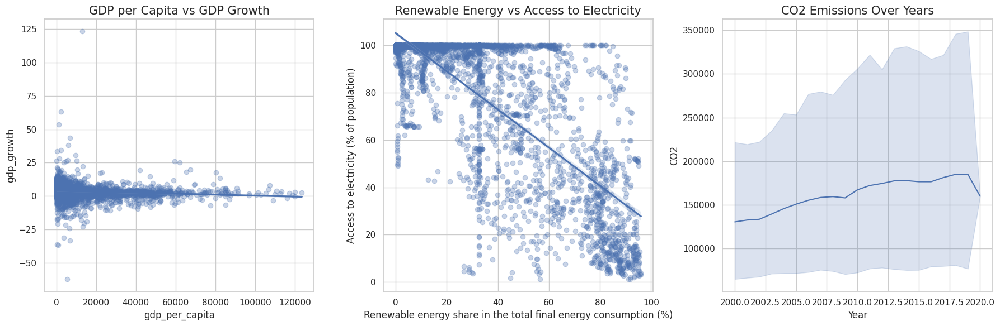

👋 Hi there, I'm **Hossein Ahmadi**

👨‍💻 **Data Scientist | Healthcare AI | Skilled in ML, DL, & Medical Imaging for Diagnosis, Prognosis, and Treatment**  
🌍 **On a mission to Build the future of Healthcare AI**  
🎯 **Tehran, Iran**

---

### 🚀 **Welcome to My GitHub Profile!**

I am a highly skilled and results-driven **Data Scientist** with over two years of expertise in **Machine Learning, Deep Learning, and predictive modeling**, particularly in **healthcare analytics**. My work is centered around creating impactful, real-world solutions, including developing robust breast cancer prediction models with accuracy scores reaching 99% on large datasets, **anomaly detection frameworks for time series data, and optimizing electricity price forecasting models using machine learning algorithms**.

With deep proficiency in **SQL, Python programming, dynamic feature scaling**, and hands-on experience with algorithms like **XGBoost, LightGBM, and Random Forest**, I excel in building scalable, **interpretable models** tailored to diverse domains. I am highly skilled in translating complex data into **actionable insights**, driving better decision-making, and pushing the boundaries of **healthcare technology** through data science.

I hold advanced certifications in **Machine Learning, SQL, and Data Science**, along with specialized training in **AI, Big Data, Advanced SQL, and MLOps**. My passion lies in harnessing the power of data to contribute to **transformative technological advancements** across fields, continually exploring new techniques to innovate and optimize solutions for **high-impact challenges**.

---

### 🔭 **Projects That Showcase My Skills**

Here’s a look at some of my notable projects that reflect my strengths in data science, machine learning, and healthcare research:

| Projects | Description |
| ------- | ----------- |
|  **Breast Cancer Predictor (BCP)** | High-accuracy model for breast cancer diagnosis, reaching 99.12% accuracy. |
|  **Anomaly Detection in Time Series** | Time series anomaly detection with advanced feature engineering. |
|  **EcoOpt** | Optimization model focused on energy efficiency and environmental sustainability. |
|  **Passive Learning in Time Series** | Forecasting model leveraging passive learning for precise predictions. |
|  **Diabetes Prediction** | Comparison of ML algorithms for reliable diabetes diagnosis. |

Check out my [Kaggle profile](https://www.kaggle.com/ahmadihossein) for more insights into my projects and achievements! 🌟

---

### 🌱 **Currently Mastering**

I'm constantly learning and expanding my expertise. Here are some of the areas I'm diving into:

- **Advanced ML Techniques**: Pushing boundaries with ensemble methods, hyperparameter tuning, and interpretability in healthcare.
- **Big Data Analytics**: Utilizing **BigQuery ML** to manage and analyze large datasets for predictive modeling.
- **Geospatial Data Analysis**: Enhancing my skills in location-based data analysis and mapping insights for urban and healthcare sectors.

---

### 💬 **Let's Talk About**

I’m always eager to connect with others on topics including:

- **Data Science & Machine Learning**: Techniques, algorithms, and real-world applications.
- **Healthcare AI**: Innovations in predictive analytics and diagnostics.
- **Career in Data Science**: Advice on projects, Kaggle, and skill-building.

---

### 📫 **Get in Touch**

I'm open to collaborations, discussions, and new opportunities!  
💼 LinkedIn: [Hossein Ahmadi](https://www.linkedin.com/in/hossein-ahmadii/)  
🌐 Kaggle: [Hossein Ahmadi](https://www.kaggle.com/ahmadihossein)

---

### ⚡ **A Little More About Me**

Driven by curiosity and a deep commitment to making a difference, I approach every challenge with a problem-solving mindset. From implementing complex algorithms to building intelligent healthcare models, my passion for data science empowers me to make meaningful contributions.

Whether you're interested in collaborating on a project or simply want to connect, feel free to reach out! 😊

---

### 📈 **My GitHub Stats**

---

**🔗 Useful Links**  
- [Blog](https://www.linkedin.com/groups/8165318/)  
- [Resume](https://www.linkedin.com/in/hossein-ahmadii/overlay/1724718739553/single-media-viewer/?type=DOCUMENT&profileId=ACoAADDOWDkBIkpA23E6RdF2inMvboSY5jD2OKg)  

---

Thanks for visiting my profile! 😊 Let's create innovative solutions together!
