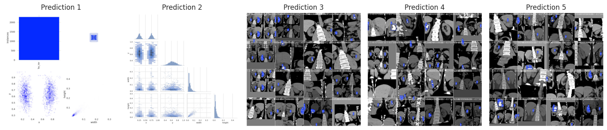

# 👋 Hi there, I'm **Hossein Ahmadi**

**👨‍💻 Data Scientist — Healthcare AI**  
**🧠 ML & DL • Medical Imaging (Diagnosis, Prognosis, Treatment)**  
**🌍 On a mission to build the future of Healthcare AI**  
**📍 Tehran, Iran**

<!-- Badges (optional) -->

  
  
  

 <!-- Update the image path if needed -->

---

## 🚀 Welcome to My GitHub

I’m a results-driven **Data Scientist** with 2+ years of experience in **machine learning, deep learning, and predictive modeling**—with a strong focus on **healthcare analytics**. I design models that ship and matter: from **robust breast-cancer predictors** (≈99% on large datasets) to **time-series anomaly detection** and **electricity price forecasting** pipelines.

I build scalable, **interpretable** systems using **Python, SQL**, and algorithms like **XGBoost, LightGBM, Random Forest**, with a strong emphasis on **explainability, evaluation, and deployment**. I also hold advanced certifications in **ML, SQL, and Data Science**, plus training in **AI, Big Data, Advanced SQL, and MLOps**.

---

## 🔭 Selected Projects

| Project | What it does |
| --- | --- |
|  **Breast Cancer Predictor (BCP)** | High-accuracy breast cancer diagnosis model (≈ 99.12% on dataset). Interpretable pipeline + strong evaluation. |
|  **Time-Series Anomaly Detection** | End-to-end anomaly detection with advanced feature engineering and robust thresholds. |
|  **EcoOpt** | Optimization for energy efficiency & sustainability with ML-assisted decision rules. |
|  **Passive Learning in Time Series** | Forecasting with passive/online learning for drift-prone signals. |
|  **Diabetes Prediction** | Rigorous comparison of ML models for reliable diagnosis under class-imbalance constraints. |
|  **Kidney Stone Detection** | YOLOv8-based detection & localization (mAP@0.5 ≈ 99.5%) with clean data curation. |
|  **Medical Insurance Cost Predictor** | Ensemble regression for premium estimation (R² ≈ 0.997) with feature importance & calibration. |

> Explore more on my **[Kaggle](https://www.kaggle.com/ahmadihossein)**.

---

## 🌱 Currently Mastering

- **Advanced ML**: ensembles, hyperparameter optimization, model interpretability for clinical settings  
- **Big Data**: **BigQuery ML** for large-scale modeling & analytics  
- **Geospatial Analytics**: location intelligence for urban & healthcare insights

---

## 💬 Let’s Talk About

- **Data Science & ML** (from problem framing to deployment)  
- **Healthcare AI** (predictive diagnostics, imaging, model validation)  
- **Career & Projects** (Kaggle, portfolios, practical roadmaps)

---

## 📫 Get in Touch

**LinkedIn:** [Hossein Ahmadi](https://www.linkedin.com/in/hossein-ahmadii/)  
**Kaggle:** [ahmadihossein](https://www.kaggle.com/ahmadihossein)

---

## ⚡ A Little More About Me

Curious, practical, and impact-oriented. I enjoy turning complex data into **actionable insights** and building **trustworthy ML**—especially in healthcare, where rigor and clarity truly matter.

---

## 📈 Advanced GitHub Analytics

> Compact, professional, and collapsible for faster page load. Everything is set to `ahmadi-hossein`.

  
<b>Core Stats & Streak</b>

  

    
    
  

  
<b>Profile Summary & Productive Hours</b>

  

    
  

  

    
    
  

  
<b>Languages (by repos, commits & bytes)</b>

  

    
    
  

  

    
  

  
<b>Activity Graph & Trophies</b>

  

    
  

  

    
  

<!--
If you set up lowlighter/metrics (GitHub Action), uncomment this block:

  

-->

---

## 🔗 Useful Links

- **Blog/Community:** https://www.linkedin.com/groups/8165318/  
- **Resume:** https://www.linkedin.com/in/hossein-ahmadii/overlay/1724718739553/single-media-viewer/?type=DOCUMENT&profileId=ACoAADDOWDkBIkpA23E6RdF2inMvboSY5jD2OKg

---

Thanks for visiting! If you’re exploring collaborations in **Healthcare AI** or data-intensive products, I’d love to connect. 🚀
